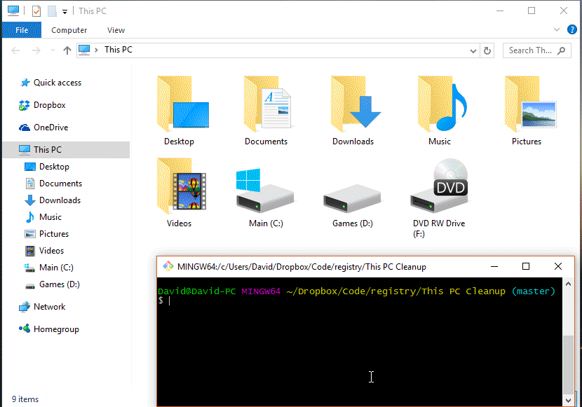

# This PC Folders

Python script for hiding and showing the folders under "This PC" on Windows 10.



```bash
$ python this_pc_folders.py hide
$ python this_pc_folders.py show
```

This script simply sets the ThicPCPolicy key of all the folders to "Hide" and "Show". It does not modify the registry in any other way.

## Caveats

This implementation is not guaranteed to work on your version of Windows. This script was tested and working on Windows 10 64bit, version 1607, OS Build 14393.576 and working as of December 30, 2016.

It should work on all versions of Windows 10, but could potentially break in future releases.
